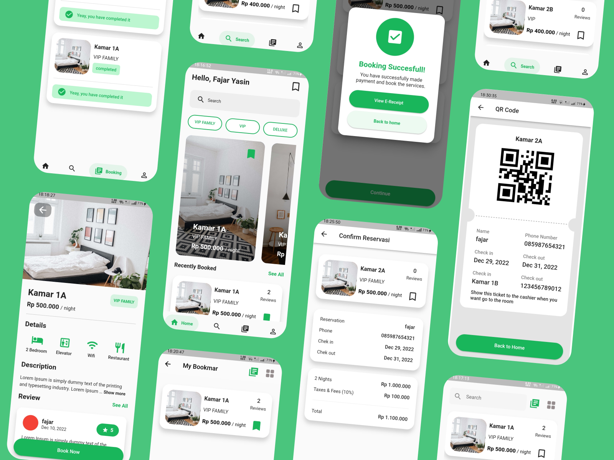

# Hamo

Hamo adalah aplikasi booking kamar untuk penginapan, yang dirancang menggunakan dart (Flutter) dan menggunakan state management GetX. Aplikasi ini juga sudah terintegrasi dengan server yang di bangung menggunakan framework Laravel.


Figma By Sobakhul Munir Siroj
 ```go
   https://www.figma.com/community/file/1096437060987595028
```

## Preview


## Installation Flutter


1. Clone the repo

   ```bash
   git clone https://github.com/jarrfajar/helia-frontend
   ```
2. Install packages

   ```dart
   flutter pub get
   ```
## Installation Laravel

This project is a starting point for a Flutter application.

1. Clone the repo

   ```bash
   git clone https://github.com/jarrfajar/helia-backend
   ```
2. Install NPM packages

   ```npm
   npm install
   ```
3. Install Composser

   ```composer
   composer install
   or
   composer update
   ```
4. Database

   ```laravel
   create a database with the name helia
   and
   import database
   ```

5. Set up Laravel configurations

   ```laravel
   copy .env.example .env
   php artisan key:generate
   ```
6. Set your database in .env

   ```laravel
   DB_DATABASE=helia
   ```
7. File Storage

   ```laravel
   php artisan storage:link
   ```
8. Login credentials

   ```laravel
   email: fajar@gmail.com
   password: fajar123
   ```
